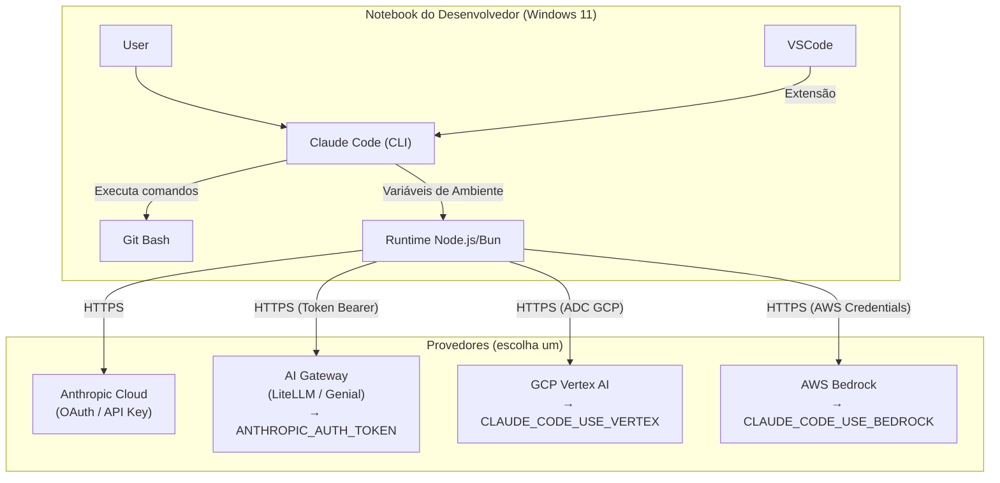

# Claude Code no Windows 11 — Configuração e Instalação

Este documento consolida em um único guia toda a informação necessária para configurar, instalar e usar o **Claude Code** no Windows 11 com Git Bash, cobrindo os seguintes casos de uso:

| Caso de uso | Quem usa |
| --- | --- |
| **Assinatura Anthropic** (Pro, Max, Team, Enterprise) | Usuários com plano claude.ai |
| **API direta Anthropic** (Console) | Desenvolvedores com chave `sk-ant-` |
| **GCP Vertex AI** | Equipes com infraestrutura GCP |
| **AWS Bedrock** | Equipes com infraestrutura AWS |
| **AI Gateway / LLM Proxy** (ex.: LiteLLM, Genial) | Ambientes corporativos com gateway centralizado |

---

## 1. Conceitos Essenciais Antes de Começar

### 1.1. O que é o Claude Code

O **Claude Code** é uma ferramenta de interface de linha de comando (CLI) baseada em agentes autônomos de IA generativa. Diferente de assistentes de chat comuns, ele tem capacidade agêntica: pode ler a estrutura de diretórios, analisar arquivos de código, executar comandos no shell, e realizar edições complexas em múltiplos arquivos de forma autônoma.

O **Claude Code** também pode ser instalado como extensão no **VS Code** e como plugin nos produtos da JetBrains. Nesses casos, abre uma janela de chat integrada à IDE — mas as funcionalidades de automação via linha de comando ficam disponíveis apenas no CLI.

**Arquivos e diretórios no Windows (instalação padrão):**

| Caminho | O que é |
| --- | --- |
| `%USERPROFILE%\.local\bin\claude.exe` | Binário executável do CLI |
| `%USERPROFILE%\.claude\` | Diretório de configuração |
| `%USERPROFILE%\.claude\settings.json` | Configuração global do agente |
| `%USERPROFILE%\.claude\.credentials.json` | Credenciais de autenticação |
| `%USERPROFILE%\.claude.json` | Preferências (tema, histórico de dicas) |

> **Atenção — padrão XDG:** O **Bash RC for Devs** adota o padrão XDG de diretórios. Portanto, o `settings.json` global do Claude Code ficará em `$HOME/.config/claude/settings.json` em vez do caminho padrão acima. Isso é controlado pela variável `CLAUDE_CONFIG_DIR`.

### 1.2. Autenticação — Qual Variável Usar em Cada Caso

Esta é a dúvida mais comum. O Claude Code suporta vários métodos de autenticação, escolhidos automaticamente na seguinte ordem de prioridade (do mais ao menos prioritário):

| Prioridade | Variável / Método | Quando usar |
| :---: | --- | --- |
| **1** | `CLAUDE_CODE_USE_BEDROCK=1` + credenciais AWS | Acesso via AWS Bedrock |
| **1** | `CLAUDE_CODE_USE_VERTEX=1` + credenciais GCP | Acesso via GCP Vertex AI |
| **1** | `CLAUDE_CODE_USE_FOUNDRY=1` + credenciais Azure | Acesso via Microsoft Foundry |
| **2** | `ANTHROPIC_AUTH_TOKEN` | AI Gateway / LLM Proxy (LiteLLM, Genial, etc.) |
| **3** | `ANTHROPIC_API_KEY` | API direta da Anthropic Console (`sk-ant-…`) |
| **4** | `apiKeyHelper` (script em `settings.json`) | Credenciais dinâmicas / rotativas (vault) |
| **5** | OAuth via browser (padrão) | Assinatura Pro, Max, Team ou Enterprise |

**Regra para assinantes Pro/Max:** **NÃO defina `ANTHROPIC_API_KEY` no ambiente.** Se ela estiver definida, o Claude Code a usa e cobra via API pay-as-you-go, ignorando sua assinatura. A autenticação correta é feita pelo browser na primeira execução de `claude`.

**Diferença entre `ANTHROPIC_AUTH_TOKEN` e `ANTHROPIC_API_KEY`:**

- `ANTHROPIC_API_KEY`: chave de API nativa da Anthropic, obtida no [Console da Anthropic](https://platform.claude.com/settings/keys). Enviada como cabeçalho HTTP `X-Api-Key`. Uso exclusivo com a API direta da Anthropic.
- `ANTHROPIC_AUTH_TOKEN`: token Bearer genérico. Enviado como cabeçalho HTTP `Authorization: Bearer <token>`. Usado quando você roteia as requisições por um **AI Gateway ou proxy LLM** (LiteLLM, Genial, etc.) que autentica com tokens Bearer em vez de chaves Anthropic. Sempre combinado com `ANTHROPIC_BASE_URL` apontando para o gateway.

### 1.3. Uso de Modelos de Outros Provedores (não-Anthropic)

O **Claude Code** foi desenvolvido para usar modelos Claude. Ele **não suporta nativamente** modelos de outros provedores como `gemini-2.5-pro` ou `gpt-4o`.

Porém, há duas situações distintas a considerar:

**a) GCP Vertex AI e AWS Bedrock** — Nesses casos, você ainda usa **modelos Claude** (Sonnet, Haiku, Opus), mas hospedados e cobrados pela infraestrutura do provedor de nuvem, não diretamente pela Anthropic. As variáveis de modelo continuam sendo IDs de modelos Claude, com formato específico do provedor:

```bash
# Vertex AI — formato: nome-do-modelo@versão
ANTHROPIC_MODEL='claude-sonnet-4-6@20260514'
ANTHROPIC_DEFAULT_HAIKU_MODEL='claude-haiku-4-5@20251001'

# AWS Bedrock — formato: região.anthropic.nome-do-modelo-v1:0
ANTHROPIC_MODEL='us.anthropic.claude-sonnet-4-6-v1:0'
ANTHROPIC_DEFAULT_HAIKU_MODEL='us.anthropic.claude-haiku-4-5-v1:0'
```

**b) Modelos de terceiros via AI Gateway (LiteLLM, Bifrost, etc.)** — É possível usar modelos como Gemini ou GPT-4o com a interface do Claude Code **somente via um proxy que traduza o formato de API**. O LiteLLM faz essa tradução automaticamente. Porém, como o Claude Code foi otimizado para os recursos específicos dos modelos Claude (uso de ferramentas, raciocínio agêntico), a experiência com modelos de terceiros é inferior. Se precisar alternar entre múltiplos provedores, avalie ferramentas como Aider ou OpenCode.

---

## 2. Pré-requisitos de Instalação

Realize **todas** as configurações desta seção antes de instalar o Claude Code.

### 2.1. Pressupostos deste documento

- O usuário do Windows não tem privilégios administrativos.
- Preferência pelo uso do Git Bash em vez de PowerShell ou CMD para configurações.
- O Git for Windows está instalado em `D:\%USERNAME%\Apps\Git` (não no caminho padrão).
- O **Bash RC for Devs** com padrão XDG está configurado: `settings.json` global ficará em `$HOME/.config/claude/`.

### 2.2. Verificar se o Git Bash está acessível

O Claude Code requer o Git Bash para executar comandos no Windows. Abra um Git Bash e confirme:

```bash
which bash   # deve retornar o caminho do bash.exe
git --version
```

### 2.3. Definir `CLAUDE_CODE_GIT_BASH_PATH` nas variáveis de ambiente do Windows

Como o Git for Windows está instalado em caminho não padrão (`D:\%USERNAME%\Apps\Git`), você **deve** definir esta variável para que o Claude Code encontre o bash:

1. Abra o Git Bash e execute:
   ```bash
   where bash
   # Exemplo de resultado: D:\%USERNAME%\Apps\Git\bin\bash.exe
   ```

2. Abra **"Editar as variáveis de ambiente para sua conta"** no Windows 11.

3. Na seção superior (**Variáveis de usuário para `%USERNAME%`**), clique em **Novo...**

4. Preencha:
   | Campo | Valor |
   | --- | --- |
   | Nome da variável | `CLAUDE_CODE_GIT_BASH_PATH` |
   | Valor da variável | `D:\SeuUsuario\Apps\Git\bin\bash.exe` |

> **Nota:** Substitua `SeuUsuario` pelo nome real da sua pasta de usuário. O script `31-claude-code-envs.sh` tenta auto-descobrir o bash, mas em caminhos não padrão a definição manual é obrigatória.

### 2.4. Definir `CLAUDE_CONFIG_DIR` para o padrão XDG

O **Bash RC for Devs** usa o padrão XDG. Para que o Claude Code respeite esse padrão, defina:

1. No mesmo aplicativo **"Editar as variáveis de ambiente para sua conta"**, clique em **Novo...**

2. Preencha:
   | Campo | Valor |
   | --- | --- |
   | Nome da variável | `CLAUDE_CONFIG_DIR` |
   | Valor da variável | `C:\Users\SeuUsuario\.config\claude` |

   > **Atenção:** Use o caminho Windows com barras invertidas aqui (variável do sistema operacional). Dentro do Git Bash, esse caminho é acessível como `$HOME/.config/claude`.

3. Abra um Git Bash e crie o diretório e o arquivo de configuração:
   ```bash
   mkdir -p $HOME/.config/claude
   touch $HOME/.config/claude/settings.json
   ```

### 2.5. Verificar instalação do Node.js (apenas para instalação via npm — opcional)

O **instalador nativo** do Claude Code (recomendado pela Anthropic desde outubro de 2025) **não requer Node.js**. Ele baixa e instala um binário autocontido.

Se preferir instalar via `npm` (método legado), verifique:

```bash
node -v   # deve ser v18 ou superior
```

> **Dica:** Prefira o instalador nativo. Ele é mais simples, não tem dependências e atualiza automaticamente em segundo plano.

### 2.6. Verificar acesso para download do instalador

Em um navegador, acesse **`https://claude.ai/install.cmd`**:

- Se abrir uma janela de download: seu usuário tem acesso. Cancele o download.
- Se ocorrer timeout ou erro 403: provavelmente você está em ambiente corporativo com restrições de rede. Abra um chamado para o time de TI.

### 2.7. Configurar certificado SSL (apenas para ambientes corporativos com proxy de inspeção SSL)

> **Usuários domésticos com plano Pro/Max da Anthropic:** Não precisam desta etapa.

Em ambientes corporativos com inspeção SSL (proxy MITM), o Claude Code pode recusar conexões com erro `Self-signed certificate` ou `UNABLE_TO_VERIFY_LEAF_SIGNATURE`. Isso ocorre porque o runtime Node.js/Bun não usa a loja de certificados nativa do Windows.

A solução é apontar `NODE_EXTRA_CA_CERTS` para um arquivo `.pem` com o certificado raiz corporativo.

**Opção A — Deixar o Bash RC for Devs gerenciar automaticamente:**

O script `31-claude-code-cert.sh` baixa o certificado raiz automaticamente ao abrir o Git Bash e exporta `NODE_EXTRA_CA_CERTS` para a sessão.

Para validar que o arquivo foi gerado:
```bash
ls $HOME/.config/certs/ca_root.pem       # confirma existência
openssl x509 -in $HOME/.config/certs/ca_root.pem -noout -subject  # exibe o subject do cert
```

**Opção B — Definir manualmente nas variáveis de ambiente do Windows:**

1. Obtenha o arquivo `.pem` do certificado raiz corporativo com o time de TI.

2. Salve em um caminho acessível, por exemplo: `D:\SeuUsuario\home\.certs\ca_root.pem`

3. Em **"Editar as variáveis de ambiente para sua conta"**, adicione:
   | Campo | Valor |
   | --- | --- |
   | Nome da variável | `NODE_EXTRA_CA_CERTS` |
   | Valor da variável | `D:\SeuUsuario\home\.certs\ca_root.pem` |

4. Confirme o conteúdo do arquivo:
   ```bash
   cat $HOME/.config/certs/ca_root.pem
   ```
   Resultado esperado:
   ```
   -----BEGIN CERTIFICATE-----
   várias+linhas+com+o+mesmo+comprimento
   e+a+última+linha+provavelmente+é+menor=
   -----END CERTIFICATE-----
   ```
   O arquivo deve conter exatamente um certificado (um bloco `BEGIN`/`END`).

### 2.8. Criar o arquivo `settings.json` global

O `settings.json` global controla o comportamento do Claude Code para todos os projetos do usuário. Abaixo estão os templates para cada caso de uso.

Abra o arquivo criado em `$HOME/.config/claude/settings.json` e cole o template do seu caso de uso:

---

#### Template A — Assinatura Anthropic (Pro, Max, Team, Enterprise)

**Não defina `ANTHROPIC_API_KEY`**. A autenticação é feita via OAuth (browser) na primeira execução.

```json
{
  "$schema": "https://json.schemastore.org/claude-code-settings.json",
  "env": {
    "CLAUDE_CODE_DISABLE_NONESSENTIAL_TRAFFIC": "1"
  },
  "permissions": {
    "deny": [
      "Read(./.env)",
      "Read(./.git/**)",
      "Read(**/node_modules/**)",
      "Read(**/build/**)",
      "Read(**/dist/**)",
      "Read(**/*.pem)",
      "Read(**/*.key)"
    ]
  }
}
```

---

#### Template B — API direta da Anthropic Console

Para quem acessa via chave de API (`sk-ant-…`) obtida em [platform.claude.com](https://platform.claude.com/settings/keys).

```json
{
  "$schema": "https://json.schemastore.org/claude-code-settings.json",
  "env": {
    "ANTHROPIC_API_KEY": "sk-ant-SuaChaveAqui",
    "CLAUDE_CODE_DISABLE_NONESSENTIAL_TRAFFIC": "1"
  },
  "permissions": {
    "deny": [
      "Read(./.env)",
      "Read(./.git/**)",
      "Read(**/node_modules/**)",
      "Read(**/*.pem)",
      "Read(**/*.key)"
    ]
  }
}
```

> **Atenção:** Não coloque a chave em arquivos versionados no Git. Se trabalhar em equipe, defina `ANTHROPIC_API_KEY` nas variáveis de ambiente do Windows em vez de no `settings.json`.

---

#### Template C — GCP Vertex AI (modelos Claude hospedados no GCP)

Autenticação via Google Application Default Credentials (ADC). Não é necessário `ANTHROPIC_API_KEY` nem `ANTHROPIC_AUTH_TOKEN`.

```json
{
  "$schema": "https://json.schemastore.org/claude-code-settings.json",
  "env": {
    "CLAUDE_CODE_USE_VERTEX": "1",
    "ANTHROPIC_VERTEX_PROJECT_ID": "seu-project-id-gcp",
    "CLOUD_ML_REGION": "us-east5",
    "ANTHROPIC_MODEL": "claude-sonnet-4-6@20260514",
    "ANTHROPIC_DEFAULT_HAIKU_MODEL": "claude-haiku-4-5@20251001",
    "ANTHROPIC_DEFAULT_OPUS_MODEL": "claude-sonnet-4-6@20260514",
    "CLAUDE_CODE_DISABLE_NONESSENTIAL_TRAFFIC": "1"
  }
}
```

**Pré-requisito:** Execute `gcloud auth application-default login` no terminal antes de usar.

> **Importante:** O Vertex AI suporta apenas **modelos Claude** (Sonnet, Haiku, Opus) no Claude Code. Para usar Gemini via Claude Code, é necessário um AI Gateway como o LiteLLM. Consulte a seção [1.3](#13-uso-de-modelos-de-outros-provedores-não-anthropic).

---

#### Template D — AWS Bedrock (modelos Claude hospedados na AWS)

Autenticação via credenciais AWS padrão (perfil AWS, variáveis de ambiente, IAM role, etc.).

```json
{
  "$schema": "https://json.schemastore.org/claude-code-settings.json",
  "env": {
    "CLAUDE_CODE_USE_BEDROCK": "1",
    "AWS_REGION": "us-east-1",
    "ANTHROPIC_MODEL": "us.anthropic.claude-sonnet-4-6-v1:0",
    "ANTHROPIC_DEFAULT_HAIKU_MODEL": "us.anthropic.claude-haiku-4-5-v1:0",
    "ANTHROPIC_DEFAULT_OPUS_MODEL": "us.anthropic.claude-sonnet-4-6-v1:0",
    "CLAUDE_CODE_DISABLE_NONESSENTIAL_TRAFFIC": "1"
  }
}
```

**Pré-requisito:** Configure credenciais AWS (ex.: `aws configure` ou defina `AWS_PROFILE`).

> **Atenção:** Antes do primeiro uso, ative os modelos Claude no console AWS Bedrock em **Model access → Request access**.

---

#### Template E — AI Gateway / LLM Proxy (LiteLLM, Genial, etc.)

Use `ANTHROPIC_AUTH_TOKEN` (não `ANTHROPIC_API_KEY`) quando o gateway autentica com tokens Bearer. Combine sempre com `ANTHROPIC_BASE_URL`.

```json
{
  "$schema": "https://json.schemastore.org/claude-code-settings.json",
  "env": {
    "ANTHROPIC_AUTH_TOKEN": "sk-SeuTokenNoGateway",
    "ANTHROPIC_BASE_URL": "https://seu-gateway.empresa.com",
    "ANTHROPIC_MODEL": "claude-sonnet",
    "ANTHROPIC_DEFAULT_SONNET_MODEL": "claude-sonnet",
    "ANTHROPIC_DEFAULT_HAIKU_MODEL": "claude-haiku",
    "ANTHROPIC_DEFAULT_OPUS_MODEL": "claude-sonnet",
    "CLAUDE_CODE_SUBAGENT_MODEL": "claude-haiku",
    "CLAUDE_CODE_DISABLE_NONESSENTIAL_TRAFFIC": "1"
  },
  "permissions": {
    "deny": [
      "Read(./.env)",
      "Read(./.git/**)",
      "Read(**/node_modules/**)",
      "Read(**/*.pem)",
      "Read(**/*.key)"
    ]
  }
}
```

> **Nota sobre modelos não-Anthropic via gateway:** Se o seu gateway expõe modelos de outros provedores (Gemini, GPT-4o, etc.) com um adaptador de formato Anthropic (como o LiteLLM faz), você pode tentar usá-los definindo o nome do modelo em `ANTHROPIC_MODEL`. A experiência é funcional, mas inferior ao uso com modelos Claude nativos, pois o Claude Code é otimizado para os recursos específicos da API Anthropic.

---

### 2.9. Configurar a Extensão do Claude Code para VS Code (opcional)

Antes de instalar a extensão, defina as configurações no VS Code:

1. Pressione `Ctrl`+`Shift`+`P`, escreva `User Settings`, e clique em **User Settings (JSON)**.

2. Adicione as seguintes linhas (ajuste os valores conforme seu caso de uso na seção 2.8):

```json
{
  "claudeCode.preferredLocation": "panel",
  "claudeCode.disableLoginPrompt": false,
  "claudeCode.environmentVariables": [
    {
      "name": "ANTHROPIC_AUTH_TOKEN",
      "value": "sk-SeuTokenNoGateway"
    },
    {
      "name": "ANTHROPIC_BASE_URL",
      "value": "https://seu-gateway.empresa.com"
    },
    {
      "name": "ANTHROPIC_MODEL",
      "value": "claude-sonnet"
    },
    {
      "name": "ANTHROPIC_DEFAULT_SONNET_MODEL",
      "value": "claude-sonnet"
    },
    {
      "name": "ANTHROPIC_DEFAULT_HAIKU_MODEL",
      "value": "claude-haiku"
    },
    {
      "name": "ANTHROPIC_DEFAULT_OPUS_MODEL",
      "value": "claude-sonnet"
    },
    {
      "name": "CLAUDE_CODE_SUBAGENT_MODEL",
      "value": "claude-haiku"
    },
    {
      "name": "CLAUDE_CODE_GIT_BASH_PATH",
      "value": "D:\\SeuUsuario\\Apps\\Git\\bin\\bash.exe"
    },
    {
      "name": "NODE_EXTRA_CA_CERTS",
      "value": "C:\\Users\\SeuUsuario\\.config\\certs\\ca_root.pem"
    }
  ]
}
```

> **Por que configurar na extensão?** A extensão do VS Code não herda automaticamente as variáveis de ambiente definidas nos scripts Bash (`31-claude-code-envs.sh`). As configurações acima garantem que ela funcione corretamente independente do terminal.

> **Assinantes Pro/Max:** Para a extensão VS Code, o login via OAuth não é suportado diretamente. Gere um token com `claude setup-token` no terminal e use-o como `ANTHROPIC_AUTH_TOKEN` na configuração da extensão, **ou** use `ANTHROPIC_API_KEY` com uma chave do Console.

---

## 3. Instalar o Claude Code

### 3.1. Instalar o Claude Code CLI (instalador nativo — recomendado)

Confirme que todas as etapas da seção 2 foram concluídas. Então:

1. Abra um **Prompt de Comandos (`cmd.exe`)** ou **PowerShell**.

2. Execute o comando de instalação:

   **Via CMD:**
   ```cmd
   curl -fsSL https://claude.ai/install.cmd -o install.cmd && install.cmd && del install.cmd
   ```

   **Via PowerShell:**
   ```powershell
   irm https://claude.ai/install.ps1 | iex
   ```

3. Feche **todas** as janelas de terminal abertas.

4. Abra um novo Git Bash (para carregar as variáveis de ambiente) e verifique a instalação:

   ```bash
   claude --version
   claude doctor   # diagnóstico completo: auth, PATH, configuração, MCP
   ```

### 3.2. Autenticação na Primeira Execução

O processo varia conforme seu caso de uso:

**Assinatura Pro/Max:** Execute `claude` no Git Bash. O browser abrirá automaticamente para login. Se não abrir, pressione `c` para copiar a URL e colá-la manualmente.

**API direta / AI Gateway:** Se `ANTHROPIC_API_KEY` ou `ANTHROPIC_AUTH_TOKEN` estiverem definidos no `settings.json`, o Claude Code os usará automaticamente sem abrir o browser.

**Bedrock / Vertex AI:** Configure as credenciais do provedor antes de executar `claude`. Não é necessário login Anthropic.

### 3.3. Validar que o provedor correto está sendo usado

Dentro do Claude Code, execute:

```
/status
```

Verifique se o campo **API Provider** exibe o endpoint correto (URL do gateway, endpoint do Bedrock, etc.) e não o endpoint padrão da Anthropic, caso seu caso de uso seja diferente.

### 3.4. Instalar a Extensão para VS Code

1. Na barra lateral de Extensões do VS Code (`Ctrl`+`Shift`+`X`), pesquise:
   ```
   publisher:Anthropic "Claude Code"
   ```

2. Clique em **Instalar**.

3. Após a instalação, o ícone do Claude Code aparecerá na barra lateral. Na primeira abertura, a extensão usa o CLI já instalado e as configurações do `settings.json` da extensão definidas na seção 2.9.

---

## 4. Hierarquia de Configurações do Claude Code

O Claude Code lê configurações em múltiplas camadas. Configurações mais específicas têm precedência sobre as mais gerais:

| Prioridade | Escopo | Local | Quando usar |
| :---: | --- | --- | --- |
| **1** | Gerenciado (Managed) | Políticas de TI (registro Windows, MDM) | Políticas corporativas obrigatórias |
| **2** | Linha de comando | `claude --model nome-do-modelo` | Testes pontuais e automação |
| **3** | Local (projeto pessoal) | `PROJETO/.claude/settings.local.json` | Preferências pessoais não versionadas |
| **4** | Projeto (compartilhado) | `PROJETO/.claude/settings.json` | Configurações da equipe (no Git) |
| **5** | Usuário (global) | `$HOME/.config/claude/settings.json` | Preferências do usuário em todos os projetos |

> **Nota:** O escopo de **Shell** (`export` via scripts Bash) foi removido do quadro acima pois **não afeta a extensão do VS Code**, apenas sessões do terminal. Para garantir consistência entre CLI e extensão, prefira definir variáveis no `settings.json` global (prioridade 5) ou nas variáveis de ambiente do Windows.

---

## 5. Scripts Bash do Bash RC for Devs

O **Bash RC for Devs** fornece dois scripts que são carregados automaticamente pelo `.bashrc` ao abrir o Git Bash:

### `31-claude-code-envs.sh`

Valida as variáveis de ambiente necessárias para o Claude Code ao abrir o Git Bash. Detecta automaticamente o modo de autenticação em uso (OAuth, API Key, Gateway, Bedrock, Vertex) e exibe avisos para configurações ausentes ou potencialmente problemáticas.

### `31-claude-code-cert.sh`

**Apenas para ambientes corporativos com proxy de inspeção SSL.** Baixa o certificado raiz de `google.com:443`, compara com o certificado existente pelo fingerprint SHA-256, e atualiza o arquivo somente se tiver mudado. Exporta `NODE_EXTRA_CA_CERTS` e `SSL_CERT_FILE` para a sessão. Se `NODE_EXTRA_CA_CERTS` já estiver definida externamente (variável de ambiente do Windows), respeita o valor existente sem sobrescrever.

---

## 6. Configuração de Projeto (para equipes)

Para controlar o comportamento do Claude Code em um repositório específico, crie `.claude/settings.json` na raiz do projeto:

```json
{
  "$schema": "https://json.schemastore.org/claude-code-settings.json",
  "permissions": {
    "allow": [
      "Bash(git status)",
      "Bash(npm test)",
      "Bash(npm run lint)",
      "Read(./src/**)",
      "Read(./docs/**)"
    ],
    "deny": [
      "Read(./.env)",
      "Read(./secrets/**)",
      "Bash(rm -rf *)",
      "Bash(sudo *)"
    ]
  }
}
```

Versione este arquivo no Git (`git add .claude/settings.json`). Para preferências pessoais não compartilhadas, use `.claude/settings.local.json` (ignorado pelo Git automaticamente pelo Claude Code).

---

## 7. Desinstalação

### 7.1. Desinstalar a Extensão do VS Code

1. Na aba de Extensões, selecione **Claude Code** e clique em **Uninstall**.
2. Pressione `Ctrl`+`Shift`+`P` → **User Settings (JSON)** e remova o bloco `claudeCode.*` do arquivo.

### 7.2. Desinstalar o Claude Code CLI

```bash
rm "$USERPROFILE/.local/bin/claude.exe"  # remove o binário
rm -rf "$USERPROFILE/.claude"            # remove diretório de dados
rm "$USERPROFILE/.claude.json"           # remove preferências
```

### 7.3. Limpar Variáveis de Ambiente do Windows

Abra **"Editar as variáveis de ambiente para sua conta"** e remova:

- `CLAUDE_CODE_GIT_BASH_PATH`
- `CLAUDE_CONFIG_DIR`
- `NODE_EXTRA_CA_CERTS` (somente se não usada por outras ferramentas)
- Quaisquer outras variáveis iniciadas com `ANTHROPIC_` ou `CLAUDE_CODE_`

---

## 8. Troubleshooting

| Sintoma | Causa provável | Solução |
| --- | --- | --- |
| `claude: command not found` | PATH não atualizado | Feche e reabra o terminal. Verifique se `$HOME/.local/bin` está no PATH |
| `Git Bash not found` | `CLAUDE_CODE_GIT_BASH_PATH` incorreta | Defina a variável apontando para o `bash.exe` correto |
| `UNABLE_TO_VERIFY_LEAF_SIGNATURE` | Proxy SSL corporativo sem certificado | Configure `NODE_EXTRA_CA_CERTS` (seção 2.7) |
| Cobranças inesperadas via API | `ANTHROPIC_API_KEY` definida acidentalmente | Remova a variável; use OAuth para assinaturas Pro/Max |
| Browser não abre no login | Ambiente sem GUI (servidor remoto) | Pressione `c` para copiar a URL e cole manualmente |
| `/status` mostra endpoint Anthropic quando deveria mostrar o gateway | `ANTHROPIC_AUTH_TOKEN` ou `ANTHROPIC_BASE_URL` não carregados | Confirme se as variáveis estão no `settings.json` global ou nas variáveis do Windows |

**Comandos úteis para diagnóstico:**

```bash
claude --version              # versão instalada
claude doctor                 # diagnóstico completo
env | grep -E 'ANTHROPIC|CLAUDE'  # lista todas as variáveis ativas
```

---

## 9. Estimativa de Custos

### Planos de Assinatura da Anthropic

| Plano | Custo Fixo | Claude Code Incluído? |
| :---: | :---: | :---: |
| Free | $0 | Não |
| Pro | $20/mês | Sim |
| Max | $100–200/mês | Sim (limites maiores) |
| Team | a partir de $30/usuário/mês | Sim |

### Uso via API ou Gateway (pay-as-you-go — exemplo com Claude Sonnet 4.6)

| Tipo de token | Custo aproximado |
| --- | --- |
| Entrada (input) | ~$3 / 1M tokens |
| Saída (output) | ~$15 / 1M tokens |
| Cache | ~$0.30 / 1M tokens |

**Exemplos de custo por tarefa:**

- Scaffold de projeto Frontend (React, do zero): ~150k tokens entrada + 20k saída ≈ **$0.75**
- Scaffold de projeto Backend (Node.js, do zero): ~100k tokens entrada + 15k saída ≈ **$0.52**

> **Recomendação:** Se você usa API ou gateway, configure um orçamento máximo mensal (sugestão inicial: USD 25/mês) e monitore o consumo diariamente.

---

## Apêndice A — Diagrama de Arquitetura



---

## Apêndice B — Fontes

| Fonte | Acesso |
| --- | --- |
| [Quickstart — Claude Code Docs](https://code.claude.com/docs/en/quickstart) | Abril/2026 |
| [Advanced setup — Claude Code Docs](https://code.claude.com/docs/en/setup) | Abril/2026 |
| [Authentication — Claude Code Docs](https://code.claude.com/docs/en/authentication) | Abril/2026 |
| [Settings — Claude Code Docs](https://code.claude.com/docs/en/settings) | Abril/2026 |
| [LLM Gateway — Claude Code Docs](https://code.claude.com/docs/en/llm-gateway) | Abril/2026 |
| [Google Vertex AI — Claude Code Docs](https://code.claude.com/docs/en/google-vertex-ai) | Abril/2026 |
| [Claude Code Quickstart — LiteLLM](https://docs.litellm.ai/docs/tutorials/claude_responses_api) | Abril/2026 |
| [Managing API key env vars — Anthropic Help Center](https://support.claude.com/en/articles/12304248-managing-api-key-environment-variables-in-claude-code) | Abril/2026 |
| [Choosing a Claude plan — Anthropic Help Center](https://support.claude.com/en/articles/11049762-choosing-a-claude-plan) | Abril/2026 |
